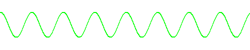

# the jazzybones word: comma (music)

let's talk about the science of sound.

if you measure the air pressure over time at a certain point within a silent
room, you'll get a very flat graph.

if you then play a "pure" note in that room (that is to say, a note without
overtones), you get a sine wave.

> technically, this is a cosine wave, but they look identical

you can see that the air pressure goes up and down at some constant pace. this
happens on the order of hundreds of times per second, the more oscillations per
second (or hertz (or hz)), the higher the note sounds.

harmony happens when the peaks and valleys of these notes line up. for example,
if Alice plays a 400hz note and Bob plays an 800hz note, each peak played by
Alice will sync up with every other peak played by Bob. in this graph, i've
drawn Alice's note on top and Bob's note on the bottom, and highlighted the
points where they sync up.

of course, in this hypothetical scenario we only have a single microphone and we
can't just separate the two notes like that. when two noise sources meet at a
single point, their air pressures add up. that is to say that if Alice and Bob
are both on a peak, our microphone would see a massive peak. it also means that
if Alice is playing a peak but Bob is playing a valley, our microphone would
detect nothing. that's actually [how noise canceling headphones
work](https://en.wikipedia.org/wiki/Active_noise_control), they listen for noise
and play "anti noise" to cancel it out.

when the frequency of one note is double the frequency of another note, it's
called an octave. we can use other ratios too, a ratio of 3:2 is called a
perfect fifth, and looks like this:

the graphs don't always look this clean. for a particularly awful example,
here's sqrt(2):1.

there's sort of a pattern there, but none of that clean, exact periodicity that
we've seen in all of the other intervals. as a general rule, simpler ratios
create cleaner periodicity and therefore sound better. the simplest ratio (2:1,
the octave) sounds so clean that when we hear two notes an octave apart, our
brains consider them the same note. the previous interval is called a
[tritone](https://en.wikipedia.org/wiki/Tritone),
and it sounds so bad that it used to be called "the Devil's interval".

> sidenote: for reasons we'll get to later, Wikipedia lists 10 separate ratios
> for a tritone, this is just the most cursed one (12-tone equal temperament).
> also, when used correctly tritones can actually be a fantastic musical tool,
> it's just convenient for the narrative of this article to call dissonance bad
> and consonance good.

so now that we have a basic understanding of music theory, let's build a piano.
we start with some "root" note, assign it some arbitrary frequency, and pick a
bunch of ratios to generate the rest of the notes. let's say that A=440hz. keep
in mind that notes an octave apart sound the same to our ears, so 880hz (one
octave up) and 220hz (one octave down) would both also be an A.

we can go up by fifths (the second cleanest interval) to generate new notes. a
fifth up from 440hz gets us 660hz, and a fifth up from that gets us 990hz. it's
more convenient to put all of these notes in the same octave, so we'll just
multiply and divide all of our frequencies by 2 until they're in the range
(440-880)hz. in this case, 990hz is outside of that range, so we bring it down
an octave to 495hz.

as we repeat this process, we get these notes:

0. 440.0hz
0. 660.0hz
0. 495.0hz
0. 742.5hz
0. 556.9hz
0. 835.3hz
0. 626.5hz
0. 469.9hz
0. 704.8hz
0. 528.6hz
0. 792.9hz
0. 594.7hz
0. 446.0hz

as you can see, 12 fifths up we get pretty close to the original note. the
actual solution that we used for thousands of years to solve this problem was to
pretend that these two notes were actually the same and choose one of them to be
the tritone so that you wouldn't play them anyways.

> sidenote: this accounts for two of the ten intervals for a tritone.

this new system that we've invented is called [Pythoagorean
tuning](https://en.wikipedia.org/wiki/Pythagorean_tuning) (although Pythagoras
didn't actually invent the system). that final ratio that was really close to
1:1 is called the [Pythagoran
comma](https://en.wikipedia.org/wiki/Pythagorean_comma), and is the subject of
this article.

any tuning system generated with this method, or any method similar to this will
always lead to commas. here's a basic proof of this fact.

1. going up by n perfect fifths gives us a ratio of 3\*\*n:2\*\*n
1. going down by m octaves gives us a ratio of 1:2\*\*m
1. going up by n perfect fifths and down by m octaves gives us a ratio of
   3\*\*n:2\*\*(n+m)
1. if we have no commas, then this ratio must equal 1:1. this would mean that
   3\*\*n = 2\*\*(n+m)
1. for any value a, the prime factorization of 3\*\*a = 3\*\*a
1. for any value b, the prime factorization of 2\*\*b = 2\*\*b
1. the prime factorization of a positive integer is unique to that integer
1. therefore, 3\*\*a will never equal 2\*\*b except for the case where a=b=0,
   since the prime factorizations of the two numbers for any other values will
   always differ
1. therefore, you cannot remove the pythagorean comma by adding more notes

this proof also works for every ratio other than an octave. you just can't use
this method to generate a tuning system without a comma.

we might try and hide the comma. with the pythagorean tuning system, we've got
12 approximately evenly spaced notes. we could just make them exactly evenly
spaced and spread the dissonance across the entire scale. in this system, there
are 12 notes, each at a ratio of (the 12th root of 2):1 apart. every 12th note
is an octave apart, and there are no other rational ratios. this system is
called [12 tone equal
temperament](https://en.wikipedia.org/wiki/12_equal_temperament), or 12tet, and
is the standard for western music today.

> sidenote: this accounts for one of the ten intervals for a tritone, and is the
> one that i used at the beginning of this article when explaining the concept
> of dissonance.

the distance between two notes in this system is called a semitone. 1/100th of a
semitone is called a cent. we can use cents to analyze music systems with
incredibly high levels of precision. in Pythagorean tuning, perfect fifths are 0
cents away from their correct ratio. in 12tet, they're approximately 1.5 cents
too high. that slight difference is small enough that we really don't notice it
in most cases, and the freedom gained by not having to hide that comma within
the tritone allowed for new forms of music, such as [modal
jazz](https://en.wikipedia.org/wiki/Modal_jazz).

in many cases, however, you don't really need a tuning system. when you're
singing in a choir without a piano, you can use whatever ratios you want
regardless of whether or not they're mathematically "pure". for that reason, it
might be nice to have a set of 12 ratios that sound nice and which are pretty
close to 12tet.

first, we need to classify the complexity of a ratio. up to now i've just been
going off vibes, so 3:2 is clearly less complex than something like
531441:524228, but if we're going to create a mathematically perfect set of 12
ratios we need a mathematical way to define perfection. that's where
[limits](<https://en.wikipedia.org/wiki/Limit_(music)>) (not calculus) come in.

Wikipedia describes limits as "an upper bound on the complexity of harmony".
this basically means that, for example, 5-limit tuning contains every ratio with
a complexity of 5 or less. there are two ways to define complexity, which we'll
call "odd complexity" and "prime complexity", because Wikipedia doesn't give
the systems themselves a name.

with odd complexity, we simplify the ratios as much as possible, factorize both
the numerator and denominator, and pick the biggest odd number. for example,
with the ratio 10:6, we simplify that to 5:3. both 5 and 3 are prime numbers, so
we just pick the larger one to get an odd complexity of 5. with the ratio 8:7,
we can't simplify it, so we find the factors of both 8 (1, 2, 4, 8) and 7 (1,
7). of all of the factors of both numbers, 7 is the largest odd number, so the
odd complexity of the ratio 8:7 is 7.

prime complexity is similar, but instead of finding the largest odd number, we
find the largest prime number. for example, the ratio 18:15 (2\*3\*3:3\*5) has a
prime complexity of 5, since the largest prime factor is 5.

we can pick some odd or prime limit and find ratios which sound pretty close to
their 12tet counterparts. there are a bunch of different ways to do this, so
i'll leave it as an exercise to the viewer.

> sidenote: this accounts for the other 7 intervals for a tritone.

there are a few interesting notes (haha) here, though. the major third (which is
approximately 4 semitones) has three different approximations according to
Pythagorean tuning, 5-prime-limit, and 12tet. Pythagorean tuning gives a ratio
of 81:64, 5-limit gives a ratio of 5:4, and 12tet gives a ratio approximately 14
cents above 5:4. for various scientific and mathematical reasons that we really
don't have time for, 5:4 is pretty much definitively the correct ratio. major
thirds are one of the most important intervals in all of music, so the fact that
12tet, the universal standard in western music today gets it wrong by a whole 14
cents is crazy to me. Pythagorean tuning gets it even worse with a whole 22
cents sharp. this specific interval has been a major point of criticism for both
of these music systems. i personally don't think that this particular comma is
too bad, since i've been surrounded by music tuned with 12tet for my entire
life and have just gotten used to the slightly buzzy quality of the major third,
but it's a real concern for musicians playing wind and string instruments who
have fine-grained control over their exact pitch and who _can_ play major thirds
14 cents flat.

you may be asking "hey jazzybones, this math is cool, but why are we even trying
to quantify music like this? doesn't quantifying the exact science of music ruin
some of the emotional rawness of it? and what if there's some new music out
there that doesn't use any of this stuff and which still sounds nice in its own
way?" and you'd be right. this math is really only essential to instrument
manufacturers and musicians playing already written music. if you're a composer
you can do whatever you want with your tuning systems. [Ben
Johnston](<https://en.wikipedia.org/wiki/Ben_Johnston_(composer)>) denoted the
exact intervals he wanted for in his pieces, which gives them a certain rawness
that i can't really describe. [Jacob
Collier](https://en.wikipedia.org/wiki/Jacob_Collier) famously uses just
intonation in pop music, adding notes that aren't even approximations of the
12tet system. it's not like these people are just making things up, though. they
have a deep understanding of all the intricacies of the current system, and use
that knowledge to extensively break the rules in a way that feels intentional.

this is a great point, though. not just in music, but with everything. we can
apply a mathematical analysis to whatever we want, but the universe is not some
internally consistent mathematical model; that's what makes it beautiful. we can
try and analyze it as much as possible, and with math and physics we might even
come pretty close, but at the end of the day there are always going to be
exceptions to whatever model we create. we'll always have a comma, or a
ridiculously sharp third, or be unable to modulate cleanly. the best that we can
do is try our best and adjust course if we're wrong.
