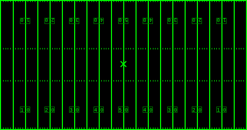

# the jazzybones word: step (marching)
## or, an explanation of the US marching band measurement system

i did marching band in high school. i really liked it. to me, marching band
mixes athleticism, teamwork, and artistic expression a really fulfilling way. if
you haven't already, you should absolutely watch Carolina Crown's 2013 show
E=mc^2. i've never done DCI (the highest level of marching band in the US), but
i've always really wanted to.

> just for reference, a football field looks like this
>
> 
>
> the top and bottom borders are called the front and back sidelines, the top
> and bottom lines in the middle are called the front and back hashes, and the
> left and right edges are called the end zones.

marching band has some really interesting metrology. when you're on a football
field, the easiest thing to reference is the massive yard lines that run across
the entire length. each line is 5 yards apart, and every unit of measurement in
marching band is fundamentally tied to that 5 yard number.

the most obvious thing to measure in marching band is your step size. we define
step sizes in terms of yard lines, so an "eight to five step" is one eighth of
five yards, or 0.625 yards, a "six to five step" is one sixth of five yards, or
0.833 yards, and so on.

the "standard" step is an 8 to 5 step. 8 to 5 steps are so standardized that
they're also just a unit of measurement. to me, the yard lines aren't really 5
yards apart, they're 8 steps apart. the front sideline is 32 steps away from the
front hash, which is 21.3 steps away from the back hash (not really, we'll get
to this), which is 32 steps away from the back sideline. the one yard "ticks" at
the sidelines and hashes are 1.6 steps apart, each tick is 1 step long, and the
X in the middle of the field is 10 steps behind the front hash.

it's weird because a "step" is a unit of distance, but a "step" is also an
action which requires you to move some distance which may not necessarily be
exactly 1 step. the yard lines define steps, and the steps define everything,
including (mentally) the yard lines.

the chaos continues! the yard lines on a football field measure the distance
away from the end zones, so there are two "zero yard lines" at the far ends of
the field, two five yard lines, two ten yard lines, and so on until they meet in
the middle at the single 50 yard line. you can't just say "the 35 yard line"
because there are two 35 yard lines that you could be referring to. you can't
just say "the left 35 yard line" either because the performers and directors are
facing each other and would have a different idea of "left". instead, we declare
that from the director's point of view, "side 1" is the left and "side 2" is the
right. if a director says "get to the side 1 35 yard line", from the performers'
perspective that means the 35 yard line on the right.

we can identify a specific location on the field with a combination of its front
to back and left to right, kind of like latitude and longitude but on a football
field. the front to back coordinates are measured relative to the front
sideline, front hash, back hash, and back sideline. for example, i might be 10
steps behind the front sideline.

left to right coordinates are measured relative to the nearest yard line. on a
football field, you can never get more than 4 steps away from a yard line, so
left to rights are much easier to get right than front to backs. at any point,
the nearest yard line could be to the left or right of you, so we have to
disambiguate that. for some reason, we do this by specifying whether we're
"inside" or "outside" the yard line, where "inside" means "closer to the 50 yard
line (the center of the field)" and "outside" means farther.

with this system, a full coordinate might sound like "2 steps inside the side 1
35 yard line and 10 steps behind the front sideline." we've just used 4 numbers
to describe a 2 dimensional quantity. gross.

it gets grosser. remember earlier when i said that the hashes were 21.3 steps
apart? that messes with a lot of coordinates, so instead we just declare "the
two hashes are actually exactly 20 steps apart, and the back hash that is
literally painted onto the field is actually in the wrong spot." this
declaration also throws off the back sideline.

this system sucks, but it somehow works. yes "inside" can mean both left and
right, yes our primary system of measurement is awful even for the imperial
system, yes we lie about where things are on the field, but this goofy system
with all of its quirks has been engrained into the minds of millions of
performers and directors and will probably remain unchanged for decades to come.

despite its flaws, i really like this system. you can feel the history of it. a
bunch of different people came up with a bunch of different ideas about
measuring things on a football field over many years and we've had to patch them
together into a single, surprisingly effective system.

i could talk about this sort of stuff and marching band in general for hours,
but this article's already getting pretty long so i'll leave that for tomorrow.
