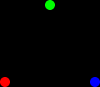
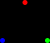
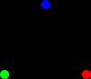
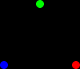
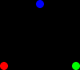
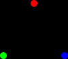

# jb crypto part 1: hardcore algebra

this is part one of a series on math and cryptography. this article is going to
be about the foundations of algebra. by the way, this article has a lot of very
long footnotes and is quite nonlinear. feel free to read this out of order if
you have to.

there are a lot of things in math. there's numbers, variables, functions, and so
on.[^everything-is-math] we can take some of these things and combine them into
new things called "sets". for example, i could combine the number 3, the
variable x, and the function f(x)=x^2 into a new set. i would write this set out
like this:

> { 3, x, f(x)=x^2 }

sets can also be infinitely large. the set of all integers, for example, looks
like this:

> { X | X is an integer }

this is "the set of all things X, where X is an integer".[^set-builder-sucks]

set theory is cool, and i'll probably write another jb crypto article about it,
but there's no way to go from "listing all the numbers" to "adding two numbers
together" with just set theory. to make that jump, we have to introduce group
theory.

a group is a set combined with an operation.[^generic-words] for example, i
might combine "the set of all integers" with the operation "addition".

an operation takes two items from a set and combines them into a new item, with
the following constraints:

1. the operation must be associative, so (x+y)+z = x+(y+z)
1. there must be some identity element e, where e+x=x and x+e=x for every x
   [^operation-semantics]
1. every element x must have an inverse element -x, where x + (-x) = e.
   [^operation-semantics]

with the integers over addition, the identity element is 0 and the inverse
element x is just -x. with the real numbers over multiplication, the identity
element is 1 and the inverse element of x is 1/x.

these rules imply that the integers with subtraction _isn't_ a group, since
(x-y)-z doesn't always equal x-(y-z).[^subtraction-counterexample]
mathematically, x-y is defined as x+(-y).

these rules _don't_ imply that x+y=y+x for every group operation. if x+y=y+x,
then it's called an [abelian
group](https://en.wikipedia.org/wiki/Abelian_group). non-abelian groups do
exist[^non-abelian-group], but proving that they do takes quite a while.

a ring is like a group except that it has two operations: addition, and
multiplication. for something to be a ring, it has to meet these criteria:

1. the ring is an abelian group over addition
1. the ring contains some element "0", which is the identity element over
   addition
1. the ring is associative over multiplication
1. the ring contains some element "1", which serves as an identity element over
   multiplication
1. multiplication is distributive over addition, so a\*(b+c) = a\*b + b\*c

note that we don't inverse elements for multiplication, so we don't have to
allow division over a ring.

the simplest example of a ring is the integers, which can be formally derived
pretty easily[^integer-derivation].

a field is a ring with the added rule that multiplication also forms an abelian
group. this basically means that you have addition, subtraction, multiplication,
and division. this also means that the integers _don't_ form a field, since, for
example, 1/3 isn't an integer.

there is so much more that i could say about all of this, but i've already
introduced enough jargon, so we'll save that for later.

[^everything-is-math]: this is just the way that i like to think about things,
    but really everything could be considered "in math". if you can think about
    something in a mathematical setting, then it's a part of math. for example,
    i might model a word problem like this one mathematically:

    > jazzybones has 1 quart of juice in their refrigerator. they drink 1 pint, and
    > buy half a gallon at the store. how much juice does jazzybones have now?

    in this case, pints, quarts, and gallons can be represented as mathematical
    units, where 2 pints = 1 quart and 4 quarts = 1 gallon. we could also
    consider "the amount of juice that jazzybones has" as a variable which
    changes over time as i drink and buy juice. for this reason, mathematicians
    don't make a distinction between "things in math" and "things in general".

    i could have rewritten the sentence that this footnote is about as

    > there are a lot of things.

    but that's a lot less clear to me.

[^set-builder-sucks]: this notation has always felt a bit unnatural to me. like,
    if i want to make a list of all the integers, i don't start by making a list
    of all the things and getting rid of everything that isn't an integer. this
    was probably my biggest hurdle as a programmer learning math.

[^generic-words]: "group" was first used in this mathematical sense by
    [&Eacute;variste
    Galois](https://en.wikipedia.org/wiki/%C3%89variste_Galois), who was a
    teenager when he basically invented group theory. i have mixed feelings
    about Galois. on one hand, he innovated mathematics and has gained
    immortality in academic consciousness. on the other hand, he decided to use
    the most generic word of all time to refer to the central concept within his
    work.

    he died in a duel at the age of 20 during the french revolution of 1830.

[^operation-semantics]: as far as i know, there isn't a single unified syntax to
    refer to the identity element of any group, or the inverse element of any
    item within a group. i've chosen the symbols that you'd use when the group
    operation is addition, since i mentioned that as an example of a group
    earlier, but this notation isn't universal.

[^subtraction-counterexample]: for example,
    (5-3)-1 = 2-1 = 1 != 5-(3-1) = 5-2 = 3

[^non-abelian-group]: i'm going to start by introducing an example of a
    non-abelian group, explaining the set that makes up the group, explaining
    the group operation, proving that it's a valid group, and explaining why
    it's a non-abelian group.

    the simplest non-abelian group is [the dihedral group of order
    6](https://en.wikipedia.org/wiki/Dihedral_group_of_order_6).

    take an equilateral triangle, color one corner red, another green, and the
    last blue. the rule is that the triangle always has to have one point facing
    upwards. i can rotate and flip this triangle in six different ways. here
    they all are:

    

    

    

    

    

    

    the general logic is that i can rotate this triangle in three different
    ways, then i can flip it over and rotate it into three new ways, creating
    six different ways of rotating a triangle. the set that makes up this
    magical non-abelian group is made up of these six different ways of rotating
    a triangle.

    let's arbitrarily define the first triangle (the "green, red, blue" one) as
    the identity element. i can rotate and flip the identity element to get
    every other element in this group. in fact, we can even define every other
    element in this group as a series of rotations and flips from the identity
    element. let's denote rotating clockwise as C, and flipping as F.

    > \[do nothing/identity element\]: GRB
    >
    > C: RBG
    >
    > CC: BGR
    >
    > F: GBR
    >
    > FC: BRG
    >
    > FCC: RGB

    the group operation is to do these transformations in order. for example,
    RBG+BRG=C+CC=CCC=the identity element.

    since the group operation is basically just string concatenation, it's
    pretty easy to show that it's associative. here's an example to hopefully
    make this obvious.

    > C+F+C=(C+F)+C=CF+C=CFC
    >
    > C+F+C=C+(F+C)=C+FC=CFC

    we can also show that every element has an inverse. there are a bunch of
    different ways to prove this, and i encourage you to find your own, here's a
    proof that i think is pretty nice.

    we'll start by noting that "CCC" and "FF" doesn't do anything, and that we
    can cancel them out whenever we see them.

    we can always cancel out the last transformation in a series by appending to
    it. if we repeatedly do this, we can cancel out everything to be left with
    the identity element. here's an example of that:

    > FC + CCF = FCCCF = FF = \[the identity element\]

    in this case, the inverse element of FC is CCF.

    we can also prove that this group isn't permutative. here's a proof by
    counterexample.

    > assume that this group is permutative
    >
    > F+C = C+F
    >
    > FC = CF
    > 
    > BRG = RGB
    >
    > contradiction!
    >
    > therefore, this group is not permutative

    this group shows that there are perfectly valid, non-permutative groups.

    by the way, we didn't have to do this with triangles. we could have used
    squares to get a group with 8 elements, pentagons to get a group with 10
    elements, and so on. this family of groups are called the [dihedral
    groups](https://en.wikipedia.org/wiki/Dihedral_group). this specific group
    is called "the dihedral group of order 6" because it has 6 elements in it
    (order is a fancy way of saying "the number of things in this thing").

[^integer-derivation]: we know from the definition of a ring that 0 and 1 are
    both integers. we also know that we can add any two integers, so we know
    that 1+1 is also an integer, 1+1+1 is an integer, 1+1+1+1 is an integer, and
    so on.  we also know that every element in a ring has an additive inverse,
    so we know that -1 is an integer, -(1+1) is an integer, -(1+1+1) is an
    integer, and so on.

    > proof that 2+2=4
    >
    > "2" is just a fancy name for "1+1", so 2+2 = (1+1)+(1+1)
    >
    > since addition is associative, (1+1)+(1+1) = 1+1+1+1
    >
    > "4" is just a fancy name for "1+1+1+1"
    >
    > therefore, 2+2=4

    we can also prove that multiplication is equivalent to repeated addition.

    > proof that multiplication is just repeated addition
    >
    > a\*b = a\*(1+1+1+... \[b times\])
    >
    > since multiplication is distributive over addition,
    >
    > a\*b = a\*1 + a\*1 + a\*1 + ... \[b times\]
    >
    > since 1 is the identity element for multiplication,
    >
    > a\*b = a + a + a + ... \[b times\]

    we've made a hidden assumption throughout this footnote which has led us to
    this specific ring, but we'll get to that some other day.
