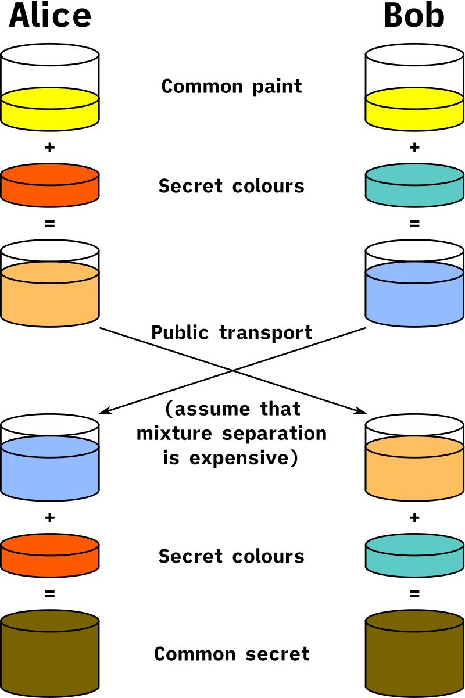

# jb crypto part 3: the discrete log problem and diffie-hellman key exchange

[read part 2 here](/blog/2024/06/26/1-finite-fields.html)

[read part 4 here](/blog/2024/06/29/0-entropy.html)

we're three parts into a series called "jb crypto" and we're finally moving on
from math to actual cryptography.

all modern cryptography relies on the idea that some problems are easy to do in
one direction, but hard to do in the other direction. for example, if i have a
calculator it's pretty easy to multiply 3\*37. if i want to figure out the
factors of 91, however, i have to manually check every number, which takes a
\very long time[^p-vs-np].

when we're doing cryptography, we want to be able to encrypt quickly but force
attackers to decrypt slowly. that makes these sorts of problems (called NP
problems) really useful.

the simplest NP problem used in cryptography is probably the discrete log
problem. given some field F, some arbitrary well-known member of that field b,
and some secret number x, we can calculate b^x pretty quickly. if we know b^x,
b, and F, however, it's really hard to figure out the original x.

let's go through an example. i've chosen some number x, and i'm telling you that
3^x mod 367 = 266. the only (known) way to calculate x is to manually check
every possible value of x until you find one that works[^x-equals-37].

i can easily calculate some arbitrary exponent very quickly, though. if i want
to calculate 3^1000000, i could calculate 3\*3\*3\*3\*... (1 million times), or
i could calculate 3\^500000\*3\^500000. i've just gone from 1000000 really small
multiplications to 500000 small multiplications and one really big
multiplication at the end. i could do this again, turning those 500000
multiplications into 250000, and so on until i get something small enough to do
quickly. in the end, i can calculate 3^1000000 in about 20 multiplications.

let's do some actual cryptography with this. let's say alice and bob are trying
to talk in secret, but eve is listening to all of their communications. because
of this, alice and bob want to encrypt their connections.

a lot of encryption algorithm (including
[AES](https://en.wikipedia.org/wiki/Advanced_Encryption_Standard) and
[salsa20](https://en.wikipedia.org/wiki/Salsa20)) require some "shared secret"
between alice and bob. they should both be thinking of the same thing, and eve
should not be able to figure out that thing.

there's a really nice algorithm to do this called diffie-hellman key exchange,
and [a really nice
diagram](https://commons.wikimedia.org/wiki/File:Diffie-Hellman_Key_Exchange.svg)
that gives a visual explanation of how it works using an analogy with color
mixing.

we begin with some shared, common color of paint, in this case it's yellow.
everybody knows this color, including alice, bob, and eve. alice and bob both
choose some secret colors of paint, in this case alice chooses orange and bob
chooses cyan. they don't tell each other these colors, because eve would be able
to hear them. instead, they alice mixes their secret orange and the public
yellow to create an orange+yellow mixture. bob mixes their secret cyan with the
public yellow to create a cyan+yellow mixture. they share these mixtures with
each other, and alice mixes bob's cyan+yellow mixture with their secret orange
to create a cyan+yellow+orange mixture. bob mixes alice's orange+yellow mixture
with their cyan to create an orange+yellow+cyan mixture, which is the same as
alice's cyan+yellow+orange mixture.

as long as eve can't unmix the cyan+yellow or orange+yellow mixtures, they can
never figure out alice and bob's original secret colors, and therefore can't
create the final cyan+yellow+orange mixture.

this algorithm is usually done with exponents. we have three public numbers: p,
n, and m, where the shared color is p^n mod m. alice and bob choose two numbers
a and b, and calculate p^a and p^b respectively (mod m). alice calculates
p\^n\*p^a = p^(n+a), and sends that to bob. bob calculates p\^n\*p^b = p^(n+b),
and sends that to alice. alice calculates p\^(n+b)\*p^a = p^(n+a+b), and bob
calculates p\^(n+a)\*p^b = p^(n+a+b). now, alice and bob have calculated the same
number, and the only way for eve to figure out what that number is is to solve
the discrete log problem to figure out either a or b.

keep in mind, this scheme works with any group with an NP discrete log problem.
in the future, we'll talk about another group that works better than
multiplication over modulo arithmetic using [elliptic
curves](https://en.wikipedia.org/wiki/Elliptic-curve_cryptography).

[^p-vs-np]: nobody actually knows if these problems exist. there are a bunch of
    problems that we think are pretty hard, but nobody knows if they're actually
    impossible or if nobody's been smart enough to solve them so far. this is
    called the [P vs NP
    problem](https://en.wikipedia.org/wiki/P_versus_NP_problem), and is probably
    the biggest unsolved problem in computer science.

[^x-equals-37]: in this case, x=37
